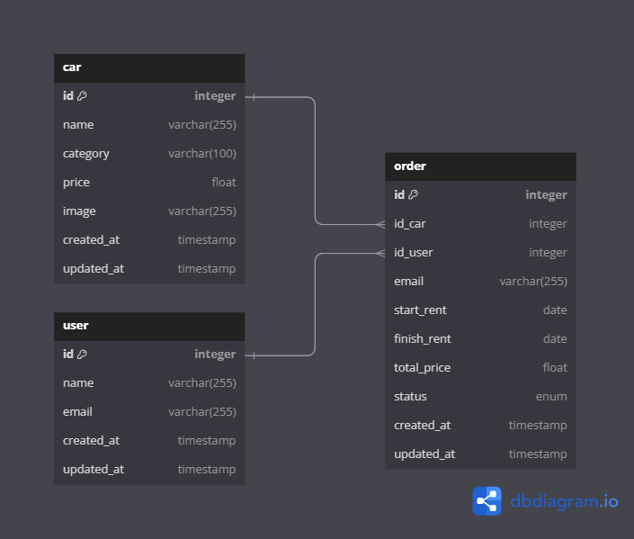

# Binar Car Rental - Car Management Dashboard

## Technologies Used

* TypeScript
* Node.js
* Express
* PostgreSQL
* Knex
* Objection.js

## How To Run:

- Local Host: Run with Postman, localhost IP, and Port:3000:
  - `http://127.0.0.1:3000/api/v1/dashboard` or
  - `http://localhost:3000/api/v1/dashboard`
- Online Domain: not deployed yet

## Entity Relationship Diagram (ERD)



Diagram source: [Razin -Car Management Dashboard (dbdiagram.io)](https://dbdiagram.io/d/Razin-Car-Management-Dashboard-6658ded2b65d933879209fe4)

## Installation

1. Clone repository:

   ```
   https://github.com/RazinSyakib43/Car-Management-Dashboard.git
   ```
2. Install project dependencies:

   ```
   npm install
   ```
3. Configure your database settings by editing the `knexfile.ts`. You can set the `user`, `password`, and `database`. Then save your changes. Example:

   ```
    development: {
       client: "postgresql",
       connection: {
         database: "car_rental_db",
         user: "your-username",
         password: "your-password"
       },
       pool: {
         min: 2,
         max: 10
       },
       migrations: {
         tableName: "knex_migrations"
       }
     },
   ```
4. Apply database schema migration:

   ```
   npx knex migrate:latest
   ```
5. Create initial data:

   ```
   npx knex seed:run
   ```
6. Run the server (with ts-node-dev for auto-reloading):

   ```
   npm run dev
   ```

## API Endpoints

* Base URL:
  ```
  http://localhost:3000/api/v1/dashboard/
  ```
  * `/cars`
  * `/users`
  * `/orders`
* Status Code:

  * **200 OK** : The request was successful.
  * **201 Created** : Resource created successfully.
  * **400 Bad Request** : The request is invalid.
  * **404 Not Found** : Data not found.
  * **500 Internal Server Error** : Server error.

### 1. Cars (/cars)

#### [GET] Get All Cars

> Retrieves a list of all available cars in the system.

Endpoint: `/api/v1/cars/`

Request Body:

```
curl --location 'http://localhost:3000/api/v1/dashboard/cars'
```

Response Body:

```
{
    "code": 200,
    "status": "success",
    "data": [
        {
            "id": 1,
            "name": "Toyota Avanza",
            "category": "MPV",
            "price": 200000,
            "start_rent": "2024-05-30T15:27:12.000Z",
            "finish_rent": "2024-06-02T15:27:12.000Z",
            "image": "https://res.cloudinary.com/dowiubuw3/image/upload/v1717012914/mhuwr8irhwqnjw7pxlmc.jpg",
            "status": "active",
            "createdAt": "2024-06-07T19:33:12.365Z",
            "updatedAt": "2024-06-07T19:33:12.365Z"
        },
        {
            "id": 2,
            "name": "Toyota Innova",
            "category": "MPV",
            "price": 300000,
            "start_rent": "2024-05-30T15:27:12.000Z",
            "finish_rent": "2024-06-06T15:27:12.000Z",
            "image": "https://res.cloudinary.com/dowiubuw3/image/upload/v1717012914/mhuwr8irhwqnjw7pxlmc.jpg",
            "status": "active",
            "createdAt": "2024-06-07T19:33:12.365Z",
            "updatedAt": "2024-06-07T19:33:12.365Z"
        },
        {
            "id": 3,
            "name": "Toyota Yaris",
            "category": "Hatchback",
            "price": 150000,
            "start_rent": null,
            "finish_rent": null,
            "image": "https://res.cloudinary.com/dowiubuw3/image/upload/v1717012914/mhuwr8irhwqnjw7pxlmc.jpg",
            "status": null,
            "createdAt": "2024-06-07T19:33:12.365Z",
            "updatedAt": "2024-06-07T19:33:12.365Z"
        },
        ...
    ]
}
```

#### [GET] Search a Car

> Searches for cars based on car name.

Endpoint: `/api/v1/cars/search?title=`

Request Body:

```
curl --location 'http://localhost:3000/api/v1/dashboard/cars/search?title=Alphard'
```

Response Body:

```
{
    "code": 200,
    "status": "success",
    "data": [
        {
            "id": 5,
            "name": "Toyota Alphard",
            "category": "MPV",
            "price": 500000,
            "start_rent": null,
            "finish_rent": null,
            "image": "https://res.cloudinary.com/dowiubuw3/image/upload/v1717012914/mhuwr8irhwqnjw7pxlmc.jpg",
            "status": null,
            "createdAt": "2024-06-07T19:33:12.365Z",
            "updatedAt": "2024-06-07T19:33:12.365Z"
        }
    ]
}
```

#### [GET] Get a Car by Id
> Retrieves detailed information about a specific car by its ID.

Endpoint: `/api/v1/cars/:id`

Request Body:

```
curl --location 'http://localhost:3000/api/v1/dashboard/cars/5'
```

Response Body:

```
{
    "code": 200,
    "status": "success",
    "data": {
        "id": 5,
        "name": "Toyota Alphard",
        "category": "MPV",
        "price": 500000,
        "start_rent": null,
        "finish_rent": null,
        "image": "https://res.cloudinary.com/dowiubuw3/image/upload/v1717012914/mhuwr8irhwqnjw7pxlmc.jpg",
        "status": null,
        "createdAt": "2024-06-07T19:33:12.365Z",
        "updatedAt": "2024-06-07T19:33:12.365Z"
    }
}
```

#### [POST] Create a Car
> Adds a new car to the system.

Endpoint: `/api/v1/cars/`

Request Body:

```
curl --location 'http://localhost:3000/api/v1/dashboard/cars/' \
--form 'name="Honda NSX 2024"' \
--form 'category="Supercar"' \
--form 'price="2500000"' \
--form 'image=@"/C:/Users/muham/OneDrive/Desktop/images/car01.min.jpg"'

```

Response Body:

```
{
    "code": 201,
    "status": "success",
    "message": "Car added successfully",
    "data": {
        "id": 6,
        "name": "Honda NSX 2024",
        "category": "Supercar",
        "price": "2500000",
        "image": "https://res.cloudinary.com/dowiubuw3/image/upload/v1717794160/erq84bihs4gbfg59zqhi.jpg"
    }
}

```

#### [PUT] Edit a Car Data
> Updates the details of a specific car by its ID.

Endpoint: `/api/v1/cars/:id`

Request Body:

```
curl --location --request PUT 'http://localhost:3000/api/v1/dashboard/cars/6' \
--form 'name=""' \
--form 'category=""' \
--form 'price="3500000"' \
--form 'image=@"/C:/Users/muham/OneDrive/Desktop/images/car11.min.jpg"'

```

Response Body:

```
{
    "code": 200,
    "status": "success",
    "message": "Car updated successfully",
    "data": {
        "id": "6",
        "name": "Honda NSX 2024",
        "category": "Supercar",
        "price": "3500000",
        "image": "https://res.cloudinary.com/dowiubuw3/image/upload/v1717794363/td0bkaoqo63vazbldxaf.jpg",
        "createdAt": "2024-06-07T21:02:40.257Z",
        "updatedAt": "2024-06-07T21:06:28.862Z"
    }
}

```

#### [DEL] Delete a Car
> Deletes a specific car from the system by its ID.

Endpoint: `/api/v1/cars/:id`

Request Body:

```
curl --location --request DELETE 'http://localhost:3000/api/v1/dashboard/cars/6'
```

Response Body:

```
{
    "code": 200,
    "status": "success",
    "message": "Car with id 6 deleted successfully"
}

```

### 2. Users (/users)

#### [GET] Get All Users

> Retrieves a list of all users registered in the system.

Endpoint: `/api/v1/users/`

Request Body:

```
curl --location 'http://localhost:3000/api/v1/dashboard/users'
```

Response Body:

```
{
    "code": 200,
    "status": "success",
    "data": [
        {
            "id": 1,
            "name": "Razin",
            "email": "razin@gmail.com",
            "created_at": "2024-06-07T19:33:12.374Z",
            "updated_at": "2024-06-07T19:33:12.374Z"
        },
        {
            "id": 2,
            "name": "Kanda Sorata",
            "email": "kandasorata@gmail.com",
            "created_at": "2024-06-07T19:33:12.374Z",
            "updated_at": "2024-06-07T19:33:12.374Z"
        },
        {
            "id": 3,
            "name": "Frieren",
            "email": "frieren@gmail.com",
            "created_at": "2024-06-07T19:33:12.374Z",
            "updated_at": "2024-06-07T19:33:12.374Z"
        }
    ]
}
```

#### [GET] Get a User by Id
> Retrieves detailed information about a specific user by their ID.

Endpoint: `/api/v1/users/:id`

Request Body:

```
curl --location 'http://localhost:3000/api/v1/dashboard/users/1'
```

Response Body:

```
{
    "code": 200,
    "status": "success",
    "data": {
        "id": 1,
        "name": "Razin",
        "email": "razin@gmail.com",
        "created_at": "2024-06-07T19:33:12.374Z",
        "updated_at": "2024-06-07T19:33:12.374Z"
    }
}
```

#### [POST] Create a User
> Registers a new user in the system.

Endpoint: `/api/v1/users/`

Request Body:

```
curl --location 'http://localhost:3000/api/v1/dashboard/users' \
--form 'name="Himmel"' \
--form 'email="himmel@gmail.com"'
```

Response Body:

```
{
    "code": 201,
    "status": "success",
    "message": "User created successfully",
    "data": {
        "id": 4,
        "name": "Himmel",
        "email": "himmel@gmail.com"
    }
}

```

#### [PUT] Edit a User Data
> Updates the details of a specific user by their ID.

Endpoint: `/api/v1/users/:id`

Request Body:

```
curl --location --request PUT 'http://localhost:3000/api/v1/dashboard/users/4' \
--form 'name="Himmel Hero"' \
--form 'email="himmel@gmail.com"'
```

Response Body:

```
{
    "code": 200,
    "status": "success",
    "message": "User with id 4 updated successfully",
    "data": {
        "id": "4",
        "name": "Himmel Hero",
        "email": "himmel@gmail.com",
        "updatedAt": "2024-06-07T21:30:03.966Z"
    }
}
```

#### [DEL] Delete a User
> Deletes a specific user from the system by their ID.

Endpoint: `/api/v1/users/:id`

Request Body:

```
curl --location --request DELETE 'http://localhost:3000/api/v1/dashboard/users/4'
```

Response Body:

```
{
    "code": 200,
    "status": "success",
    "message": "User with id 4 deleted successfully"
}
```

### Orders

#### [GET] Get All Orders
> Retrieves a list of all orders in the system.

Endpoint: `/api/v1/orders/`

Request Body:

```
curl --location 'http://localhost:3000/api/v1/dashboard/orders'
```

Response Body:

```
{
    "code": 200,
    "status": "success",
    "data": [
        {
            "id": 1,
            "user_email": "razin@gmail.com",
            "car_name": "Toyota Avanza",
            "start_rent": "2024-05-30T15:27:12.000Z",
            "finish_rent": "2024-06-02T15:27:12.000Z",
            "price": 200000,
            "total_price": 600000,
            "status": "active",
            "created_at": "2024-06-07T19:33:12.371Z",
            "updated_at": "2024-06-07T19:33:12.371Z"
        },
        {
            "id": 2,
            "user_email": "kandasorata@gmail.com",
            "car_name": "Toyota Innova",
            "start_rent": "2024-05-30T15:27:12.000Z",
            "finish_rent": "2024-06-06T15:27:12.000Z",
            "price": 300000,
            "total_price": 2100000,
            "status": "active",
            "created_at": "2024-06-07T19:33:12.371Z",
            "updated_at": "2024-06-07T19:33:12.371Z"
        }
    ]
}
```

#### [GET] Get an Order by Id
> Retrieves detailed information about a specific order by its ID.

Endpoint: `/api/v1/orders/:id`

Request Body:

```
curl --location 'http://localhost:3000/api/v1/dashboard/orders/1'
```

Response Body:

```
{
    "code": 200,
    "status": "success",
    "data": {
        "id": 1,
        "user_email": "razin@gmail.com",
        "car_name": "Toyota Avanza",
        "start_rent": "2024-05-30T15:27:12.000Z",
        "finish_rent": "2024-06-02T15:27:12.000Z",
        "price": 200000,
        "total_price": 600000,
        "status": "active",
        "created_at": "2024-06-07T19:33:12.371Z",
        "updated_at": "2024-06-07T19:33:12.371Z"
    }
}
```

#### [POST] Create an Order
> Creates a new order for renting a car.

Endpoint: `/api/v1/orders/`

Request Body:

```
curl --location 'http://localhost:3000/api/v1/dashboard/orders' \
--form 'id_car="4"' \
--form 'id_user="3"' \
--form 'start_rent="2024-06-07 15:20:00"' \
--form 'rent_duration="5"' \
--form 'status="active"'
```

Response Body:

```
{
    "code": 201,
    "status": "success",
    "message": "Order created successfully",
    "data": {
        "id": 3,
        "user_email": "frieren@gmail.com",
        "car_name": "Toyota Fortuner",
        "start_rent": "2024-06-07 15:20:00",
        "finish_rent": "2024-06-12T08:20:00.000Z",
        "price": 400000,
        "total_price": 2000000,
        "status": "active"
    }
}
```

#### [DEL] Delete an Order
> Deletes a specific order from the system by its ID.
Endpoint: `/api/v1/orders/:id`

Request Body:

```
curl --location --request DELETE 'http://localhost:3000/api/v1/dashboard/orders/3'
```

Response Body:

```
{
    "code": 200,
    "status": "success",
    "message": "Order with id 3 deleted successfully"
}
```

## Contribution

Contributions are welcome! If you find a bug or have suggestions for improvements, please open an issue or submit a pull request.

[**@2024 Muhammad Razin Syakib**](https://www.linkedin.com/in/muhammad-razin-syakib/)
